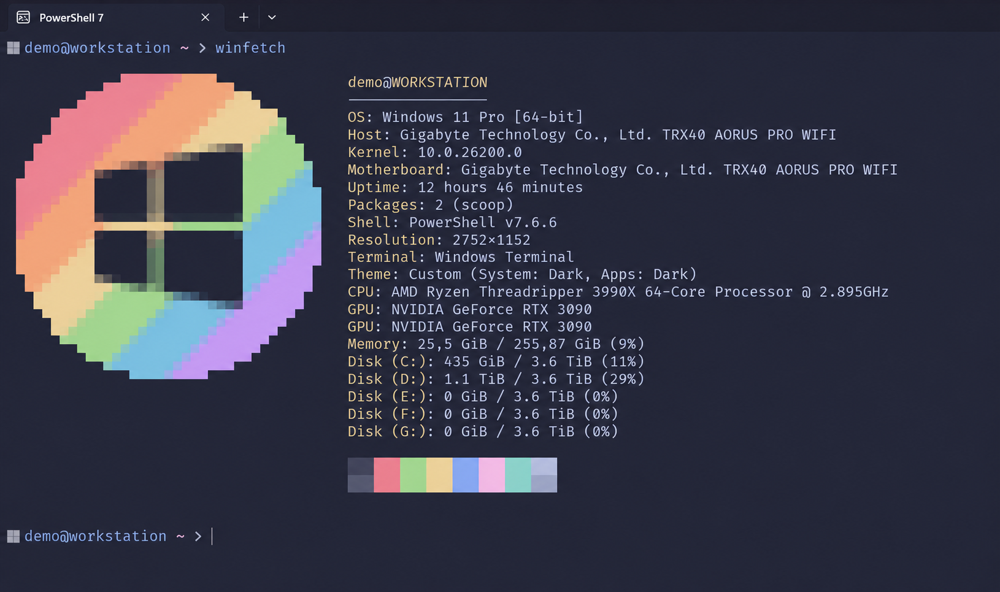

# Catppuccin PowerShell Setup

A repeatable PowerShell script that provisions a Catppuccin Macchiato command-line setup on Windows. It installs and configures Windows Terminal, PowerShell 7, Oh My Posh, PSReadLine, and the bundled FiraCode Nerd Font.



## Why this setup?

This setup gives you a consistent, polished PowerShell environment on any Windows PC without manually repeating the same configuration work.

- **Windows Terminal** provides tabs, profiles, modern rendering, and a more comfortable daily shell experience than the legacy console.
- **PowerShell 7** is the current, actively maintained PowerShell runtime and works well with modern Windows tooling.
- **Oh My Posh** adds useful context to the prompt at a glance, while Catppuccin Macchiato keeps it readable and easy on the eyes.
- **FiraCode Nerd Font** enables programming ligatures and the prompt icons, so the theme renders correctly from the first launch.
- **PSReadLine** improves command editing, history search, syntax highlighting, and inline predictions—less retyping and fewer mistakes.
- **Catppuccin Macchiato** gives the terminal and prompt one coherent, low-contrast palette, making commands, parameters, errors, and suggestions easier to distinguish.
- **Repeatable setup and backups** make moving to a new PC painless while preserving copies of existing Terminal and PowerShell profile settings before changes are made.

The goal is not only appearance: it is a faster, more readable, and reproducible command-line environment.

### Go further with Aichat

For an especially nice next step, take a look at [Aichat](https://github.com/sigoden/aichat). Its shell-assistant mode lets you describe what you want to do in natural language and generates a command suited to your shell and operating system. After configuring a provider, try:

```powershell
aichat -e "show the five largest files in this folder"
```

Always review a generated command before you run it.

## What it does

- Installs Windows Terminal, PowerShell 7, and Oh My Posh with WinGet.
- Installs the repository-bundled FiraCode Nerd Font for the current user—no font download required.
- Installs WinFetch and configures it to use the bundled Catppuccin Windows image.
- Exports the `catppuccin_macchiato` Oh My Posh theme locally.
- Adds a managed Catppuccin block to the PowerShell 7 profile with PSReadLine prediction and syntax colors.
- Creates a Catppuccin Macchiato color scheme, app theme, and PowerShell 7 profile in Windows Terminal.
- Creates timestamped backups of existing Windows Terminal and PowerShell profile files before changing them.
- Validates the result and prints a `[PASS]`/`[FAIL]` report for every component.

## Re-running and resilience

The script is written to be run again at any time, including after a failed run:

- Each step is isolated. If one component fails, the others still get configured, the failure is listed in the summary, and the script exits with a non-zero code.
- Font files are only rewritten when their contents actually differ, so a second run copies nothing.
- A font that Windows currently has loaded is replaced by renaming the in-use file aside first. This is what the error *"The requested operation cannot be performed on a file with a user-mapped section open"* means, and it no longer stops the setup.
- A half-finished font install (files on disk but no registry entries) is repaired rather than skipped.

## Tests

```powershell
Invoke-Pester -Path .\tests
```

The suite dot-sources the setup script with `-LoadFunctionsOnly`, which defines its functions without running any provisioning step. Font tests use throwaway directories and a throwaway registry key, so they never touch your installed fonts.

## Requirements

- Windows 10 or Windows 11
- WinGet (included with current Windows 11 installations)
- An internet connection for WinGet packages and the Oh My Posh theme export

Run the script as your normal user. Administrator access is normally not required, though a package installer may request elevation.

## Install

Clone or download this repository, then run the setup script from the repository root:

```powershell
Set-ExecutionPolicy -Scope Process Bypass -Force
.\Setup-CatppuccinPowerShell.ps1
```

To also ask WinGet to update packages that are already installed:

```powershell
.\Setup-CatppuccinPowerShell.ps1 -UpgradePackages
```

Close every Windows Terminal window and open it again when setup finishes.

## WinFetch

The setup installs WinFetch from the PowerShell Gallery, copies `windows-catppuccin.png` into your WinFetch configuration folder, and sets it as the WinFetch image. Open a new terminal and run:

```powershell
winfetch
```

WinFetch is not launched automatically with every terminal session.

## Font license

`assets/fonts/FiraCode.zip` is FiraCode Nerd Font. It is distributed under the SIL Open Font License 1.1; the included license copy is at [licenses/FiraCode-OFL.txt](licenses/FiraCode-OFL.txt).

## License

This project is licensed under the [MIT License](LICENSE).
